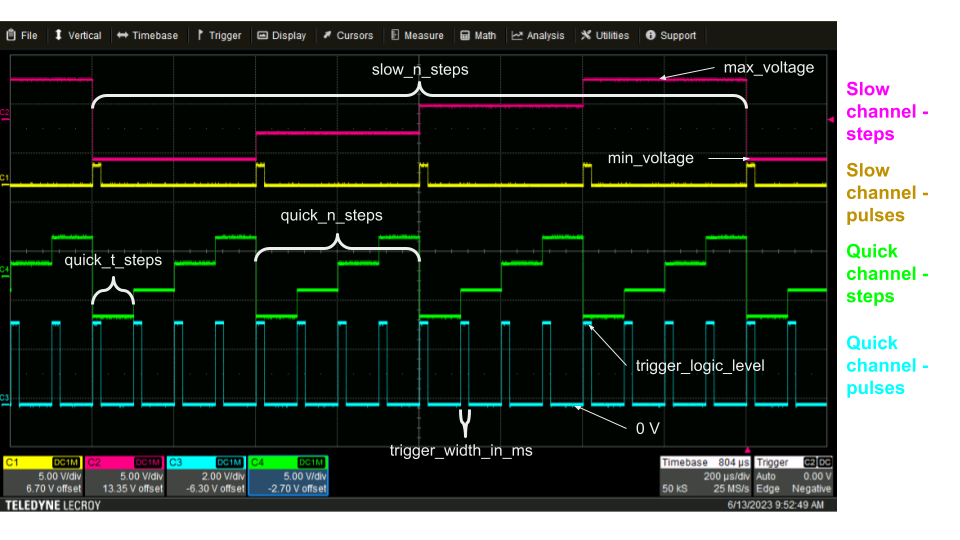
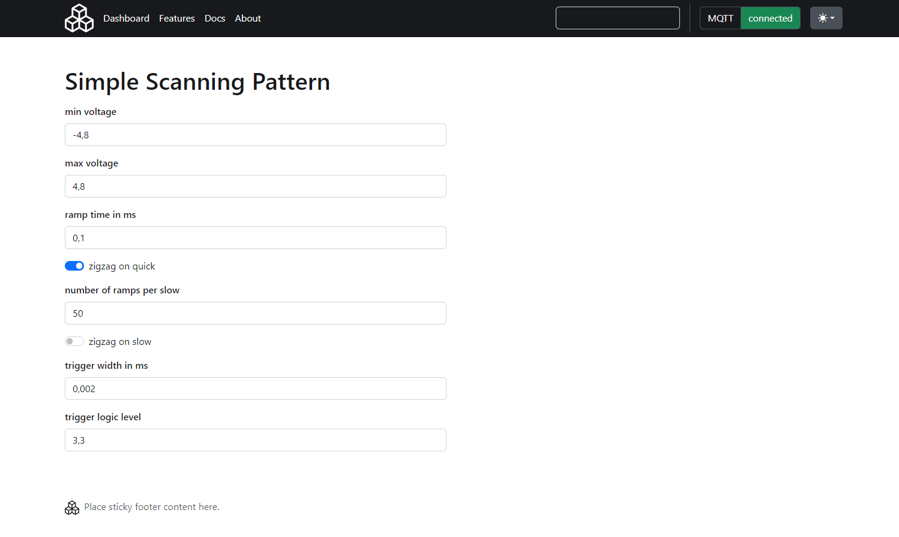

# Simple scanning pattern

## Output signal 


## Parameters
!!!Note
    This document is hand-made and not generated automatically to the firmware code. 
    To be sure to have the up-to-date version , look at the WebUI or at the API documentation.

- **min_voltage** : minimum voltage (in V) - also voltage of lowest step.
Applies to both quick and slow step channels.
- **max_voltage** : maximum voltage (in V) - also voltage of highest step.
Applies to both quick and slow step channels.
- **quick_n_steps** : Total number of steps for one period on the quick channel.
- **quick_t_steps** : Width of one step, i.e. the time of a step (in ms).
- **zigzag_on_quick** : If true, makes a zigzag pattern on the quick channel.
- **slow_n_steps** : Total number of steps for one period ont he slow channel. 
- **zigzag_on_slow** : If true, makes a zigzag pattern on the slow channel.
- **trigger_width_in_ms** : The width of the trigger pulse, in ms. Applies
to both quick and slow pulse channels.
- **trigger_logic_level** : The logic high voltage level of the pulse. Applies
to both quick and slow pulse channels.



### MQTT message


Hello world

```
    {
        "name": "Name",
        "device": "ASG",
        "payload": {
            "cmd": "load_simple_scanning_pattern",
            "config": {
            "min_voltage": -4.0,
            "max_voltage": 4.0,
            "quick_n_steps": 4,
            "quick_t_steps": 0.1,
            "zigzag_on_quick": false,
            "slow_n_steps": 4,
            "zigzag_on_slow": false,
            "trigger_width_in_ms": 0.02,
            "trigger_logic_level": 3.3
            }
        }
    }
```

### Web interface



