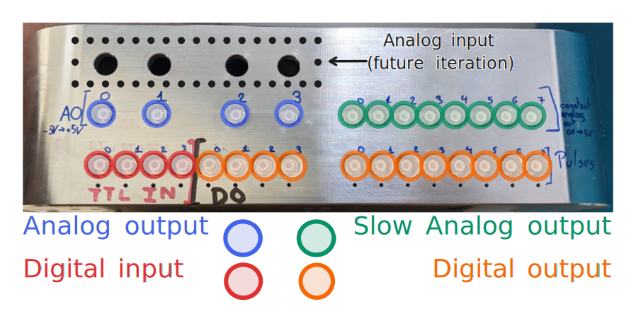

# Hardware specification

!!! Todo
    Get a better picture ?
## Analog output details

### High-speed output
* 16-bit resolution
* From -5V to +5V
* 1 MHz update rate

!!! Todo
    [oscilloscope measurement about 0 to 65535 transition]  
    [ADC calibration / non-linearity]  
    [graph about typical noise ]

### Low-speed output
* 16-bit resolution
* From 0 to 5V
* 50kHz update rate
* [graph about 0 to 65535 transition]
* [graph about noise / non-linearity ?]  => how is the non-linearity handled ?

!!! Todo
    [Add plot of low speed DAC output / transition]

## Digital I/Os details
* Designed for 50 Ohm impedance.
* Each connector is *either* input or output. There is a hardware change required to 
go from one to the other (soldering a resistor). By default, the Cube
comes with 8+4 outputs and 4 inputs.

### Inputs
* Accept 3.3V and 5V logic high (and 0V logic low).
* Minimum detectable pulse time : ~4ns (behavious might be unexpected that close to the limit). 

### Outputs
* 3.3V logic high - 0V logic low.
* Minimum pulse width : 4ns ( #ToBeConfirmed)

!!! Todo
    [Add plot of digital I/Os ?]