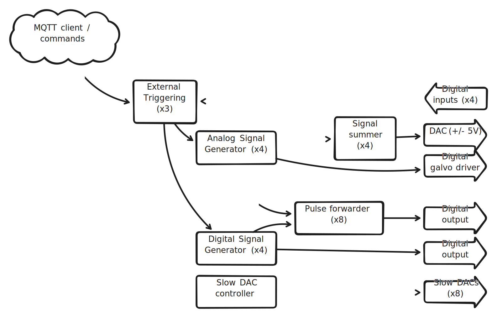

## Modules

Here is a quick overview of the internal logic of the Galaxy cube : 

* [Analog signal Generator](./modules/analog_signal_generator.md) : generates an arbitrary 16-bit signal by iterating over different sections (analytically defined 3rd order polynomial).
* [Digital signal generator](./modules/digital_signal_generator.md) : generates an arbitrary digital signal by iterating over different sections. 
* [Pulse forwarder](./modules/pulse_forwarder.md) : generates digital pulses synchronously to a specified signal generator.
* [External triggering](./modules/external_triggering.md) : starts, stops or pauses specified signal generator in case of incoming digital or mqtt input.
* [Signal summer](./modules/signal_summer.md) : sums different 16-bit signals together, before they reach the DAC.
* [Digital galvo driver](./modules/digital_galvo_driver.md) : Additional output for the 16-bit signals. Can drive a xxx-xxx galvomiror. Additional custom hardware is needed.
!!! Todo
    Ask Alejandro exactly which galvo can be driven. Is additional hardware needed ?

* [Slow Dac controller](./modules/slow_dac.md) : controls the voltage level (0-5V) of the slow dac outputs.