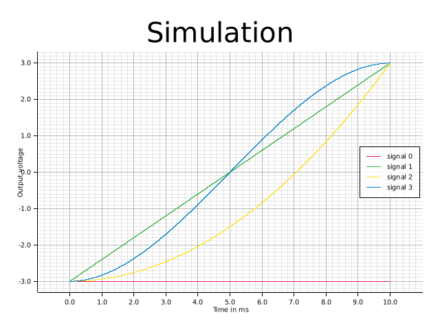
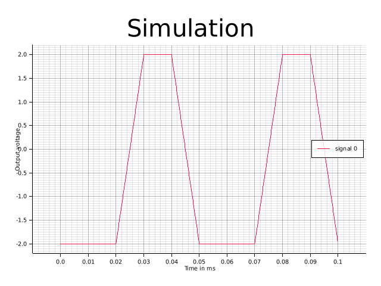

# Signal generation logic

## General principle
The Signal Generators are based on an integrator design :   

$$
Output_n = S^0_n          \\
S^0_{n+1}= S^0_n + \Delta t * S^1_n \\
S^1_{n+1}= S^1_n + \Delta t * S^2_n \\
S^2_{n+1}= S^2_n + \Delta t * S^3_n \\
S^3_{n+1}= S^3_n           
$$
!!! Note 
     The actual implementation is a bit more complex, as we’re working with (different) finite-bit number representations. We also need to do some unit conversions to take into account the cycle period, and to convert between output voltage and internal number.

A very natural way to control the output is to specify \(Section=(S^0_0, S^1_0, S^2_0, S^3_0, length)\) and then let the integrator run for a period of time. After a predefined amount of time, we can then give a new set of values, changing the output. 
This system allows to generate any *3rd degree polynomial*, which in turn allows to approximate any waveform. 

$$
     output(t) = \begin{cases}  
          f(section_0, t) \text{ for } 0 \le t < length_0 \\
          f(section_1, t) \text{ for } length_0 \le t < length_1 \\
          ... \\
          f(section_{last}, t) \text{ for } length_{last -1 } \le t < length_{last} \\
          \end{cases}
$$

## Example

*Simulation of single sections. The different types of polynomials possible are displayed. The number of a signal is equivalent to it's polynomial degree*.

*Simulation of a signal, consisting of 4 different linear sections. It's repeated once*

## Implementation options

In pratice, there are a couple more questions to solve :

- As the signal is a piecewise function, what kind of **continuity** should there be between each section?  
     - discontinous : at the transition tick, we replace all \(S^x\) values with the new ones.
     - \(C^0\) (continous) : \( S^0 = S^0_{old}\), the 3 others values are replaced 
     - \(C^1\) (continous and continous first derivative) : \( (S^0, S^1, S^2, S^3) = (S^0_{old}, S^1_{old}, S^2_{new}, S^3_{new}) \)
     - \(C^2\) : \( (S^0, S^1, S^2, S^3) = (S^0_{old}, S^1_{old}, S^2_{old}, S^3_{new}) \)
- Instead of only giving one array \( [ section_0, section_1, section_2, ... ] \), we have one array containing all the 
     section definitions, and than the ASG gets an array having pointers to the section and decribing the transition :  
     \( [(\text{pointer to section}, \text{transition type}), (\text{pointer to section}, \text{transition type}), ...] \).   
     The signal generator then steps through that array, and when it reaches the end starts over.
     *This is especially usefull for reducing memory usage of signals with pattern, like a staircase signal (flat, up, flat, up, ...).*
- In pratical, we might not want infinitely looping signal generators. To more finely control their behaviour, there are 2 mechanisms :
     - internal control : each signal generator counts how many sections and how many periods it already generated. It's possible 
          to configure them so that they stop (or pause ?) after a specified amount.
     - external control : the triggering modules can also send a pause or stop command to the signal generator.  

## Raw vs voltage sections
There are 2 ways to define the sections :

  - **Raw sections** : the values are signed 64-bits numbers, and are sent as-is to the FPGA. 
  - **Voltage sections** : Instead of giving the values for the 4 first derivatives, you select instead the starting point, the ending point, and the slope/   derivative at the start and ending point. You then select which kind of interpolation you would have : constant, linear, quadratic or cubic. The values are converted from Volt , Volt/s, etc… into the appropriate values for the FPGA - taking into account the DAC calibration and the FPGA clock speed.
